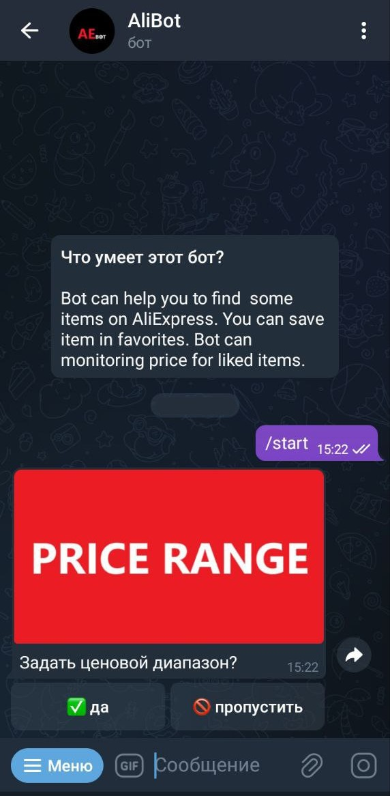
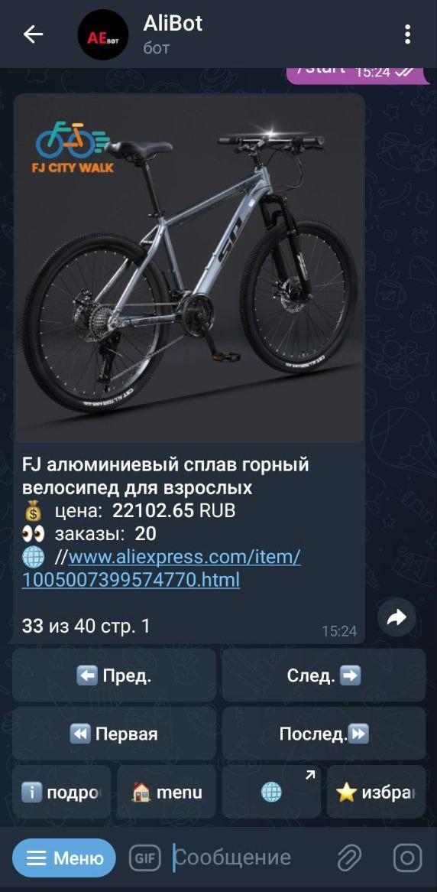
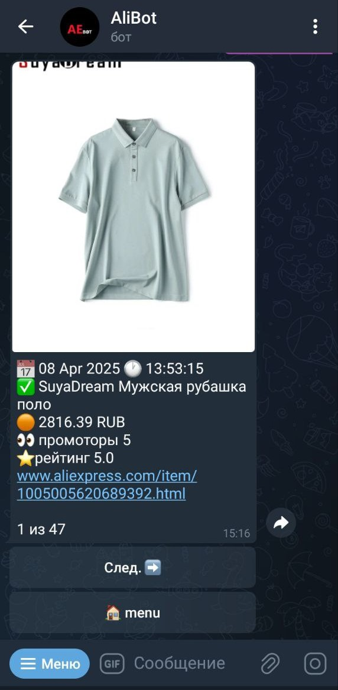
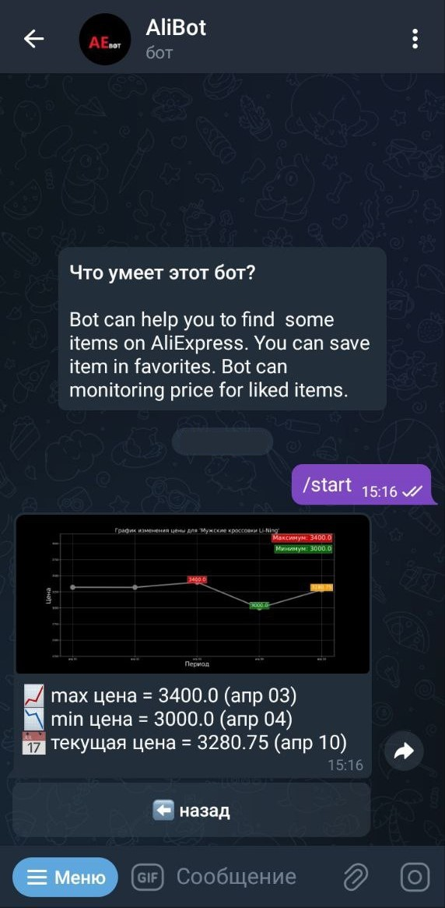
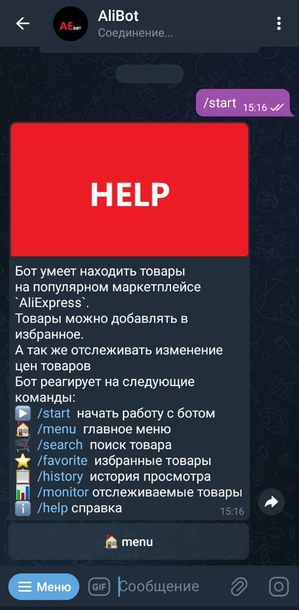
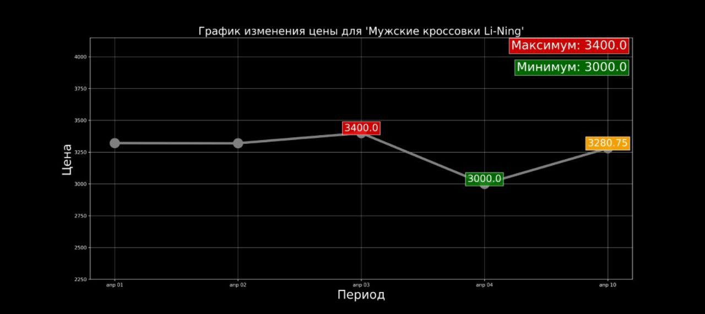
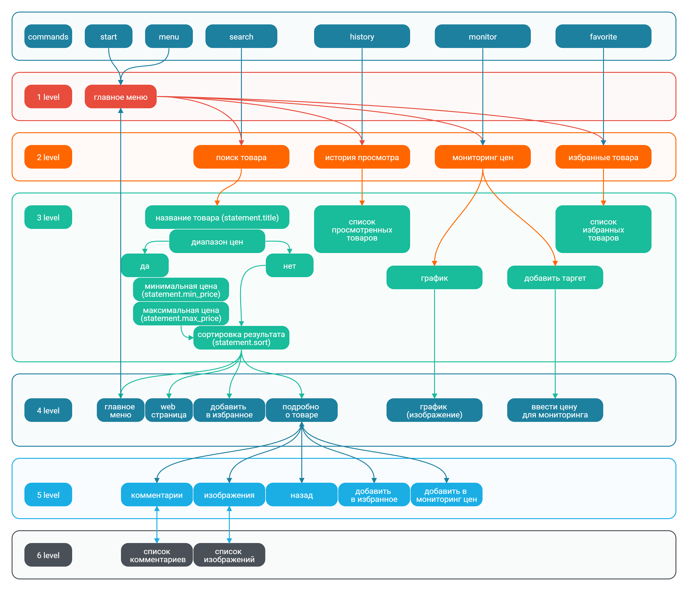
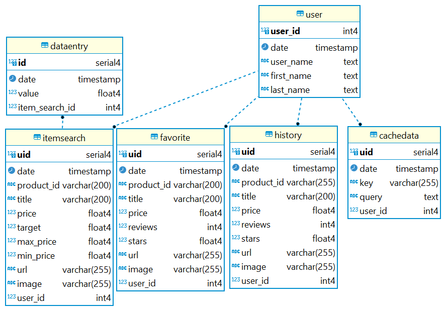

<div align="center">
  
# 🤖 AliExpress Telegram Search Bot

**Асинхронный Telegram‑бот для поиска товаров на AliExpress с избранным, историей и мониторингом цен**

[](https://www.python.org/)
[](https://docs.aiogram.dev/)
[](https://www.postgresql.org/)
[](https://redis.io/)
[](https://www.docker.com/)
[](http://docs.peewee-orm.com/)
[](https://rapidapi.com/)

</div>


### Основные возможности

- 🔍 **Поиск товаров** по названию, диапазону цен, сортировка результатов.
- ⭐ **Избранное** – добавление / удаление товаров.
- 📜 **История просмотренных товаров**.
- 📊 **Мониторинг цен** – задание пороговой цены и получение уведомлений.
- 📈 **График изменения цены** отслеживаемого товара.

## 🛠️ Технологии

| Категория       | Технологии                                                                 |
|-----------------|----------------------------------------------------------------------------|
| Язык            | Python 3.10+                                                               |
| Бот‑фреймворк   | aiogram 3.x                                                                |
| База данных     | PostgreSQL (через Peewee ORM + playhouse миграции)                         |
| Кэширование     | Redis                                                                      |
| Контейнеризация | Docker, Docker Compose                                                     |
| API             | RapidAPI (Aliexpress DataHub)                                              |
| Логирование     | Встроенный logging (info.log, error.log)                                   |

---

## 3. Структура проекта

Структура проекта:

```
src
│
├── api_aliexpress      # файлы для работы с запромами на стороний API  
│   ├── ...
├── api_redis           # файлы для работы с Redis
│   ├── ...
├── api_telegram
│   ├── callback_data   # коллбэк-дата классы
│   │   ├── ...
│   ├── commands.py     # комманды бота
│   ├── crud            # файлы с классами для CRUD операций
│   │   ├── ...
│   ├── keyboard        
│   │   ├── ...
│   │   └── paginators  # файлы с для создания клавиатуры с пагинацией
│   ├── routers         # файлы с endpoints
│   │   ├── ...
│   └── statments.py    # файл с конечными автоматами бота (FSM)
├── core
│   └── config.py       #  конфигурационный файл с основными настроками и переменными 
├── database
│   ├── ...            
│   ├── exceptions.py   # астомные исключения
│   ├── models.py       # модели БД
│   ├── orm.py          # файлы с классы для работы с БД
│   └──paginator.py     # класс для создания пагинации
│   
├── logger              # функции для логирования и лог-файлы    
├── static              # статитически файлы (изображения и файлы-json)
└── utils
   ├── cache_key.py     # функции для работы c кэш-ключами
   ├── media.py         # функции для работы с медиа файлами
   └── validators.py    # валидаторы данных
```

Прочие файлы проекта:
- `main.py` - основной файл бота
- `Dockerfile` - файл Docker
- `docker-compose.yml` - конфигурация Docker
- `.env.example` - приме файла с переменными окружения


## 4. Пример интерфейса приложения

### Поиск товара
   

### История просмотров, график цены, справка

  

### Пример графика цены отслеживаемого товара



## 5. Зависимости

Чтобы установить зависимости виртуального окружения, используйте:

```
pip install -r requirements.txt
```

## 6. Конфигурация

Перед запуском необходимо настроить:
1. Создать 2 файла `.env` и `.env.docker` на основе `.env.example`
2. Указать переменную окружения `DB_HOST` значение `localhost` для `.env` и `postgres` для `.env.docker`.
3. Указать ваш `TELEGRAM_BOT_TOKEN`
4. Указать ваш `RAPID_API_TOKEN` (Rapid API [Aliexpress DataHub](https://rapidapi.com/ecommdatahub/api/aliexpress-datahub))
5. При необходимости настроить другие параметры

## 7. Запуск

Для запуска приложения в `docker` используйте:

```
docker compose  up --build
```

Для запуска приложения на `localhost` используйте:

```
python main.py
```
## 8. Доступные команды бота

Основные команды бота:
- `/start` - начать работу с ботом
- `/help` - получить справку по командам
- `/menu` - главное меню
- `/search` - поиск товара
- `/favorite` - избранные товары
- `/monitor` - отслеживаемые товары
- `/history` - история просмотра

### Схема уровней бота


## 9. База данных

### База данных состоит из следующих таблиц: 
* `users` - таблица пользователей
* `favorites` - таблица избранных товаров
* `history` - таблица просмотренных товаров
* `cachedata` - таблица с поисковыми запросами
* `itemsearch` - таблица с отслеживаемыми товарами
* `dataentry` - таблица с ценами отслеживаемых товаров

Общая структура таблиц



## 10. Endpoints

| route          | endpoint             | command     | действие                                                 |
|----------------|----------------------|-------------|----------------------------------------------------------|
| BASE ROUTE     |                      |             |                                                          |
|                | start_command        | */start*    | начала работы с ботом                                    |
|                | help_info            | */help*     | вызов справки                                            |
|                | main_menu            | */menu*     | вызов главного меню                                      |
| DETAIL ROUTE   |                      |             |                                                          |
|                | get_item_detail      |             | предоставляет подробную информацию о товаре              |
|                | get_images           |             | возвращает список изображений товара                     |
| FAVORITE ROUTE |                      |             |                                                          |
|                | get_favorite_list    | */favorite* | возвращает список избранных товаров                      |
|                | add_favorite         |             | добавляет в избранные товары                             |
|                | delete_favorite      |             | удаляет из избранных товаров                             |
| HISTORY ROUTE  |                      |             |                                                          |
|                | get_history_list     | */history*  | возвращает список просмотренных товаров                  |
| MONITOR ROUTE  |                      |             |                                                          |
|                | get_monitoring_list  | */monitor*  | возвращает список отслеживаемых товаров                  |
|                | add_monitoring       |             | добавляет товар в список отслеживаемых товаров           |
|                | add_target           |             | предлагает добавить целевую цену                         |
|                | define_target_price  |             | добавляет целевую цену                                   |
|                | delete_monitoring    |             | удаляет товар из списка отслеживаемых товаров            |
|                | send_chart_image     |             | формирует диаграмму цены                                 |
| REVIEW ROUTE   |                      |             |                                                          |
|                | get_review_list      |             | возвращает список комментариев к товару                  |
| SEARCH ROUTE   |                      |             |                                                          |
|                | search_name_message  | */search*   | поисковой запрос (by message)                            |
|                | search_name_callback |             | поисковой запрос (by callback)                           |
|                | search_price_range   |             | запрос на ценовой диапазон                               |
|                | search_price_min     |             | запрос на минимальную цену                               |
|                | search_price_max     |             | запрос на максимальную цену                              |
|                | search_sort          |             | запрос на сортировку поисковой выдачи (с диапазоном цен) |
|                | search_sort_call     |             | запрос на сортировку поисковой выдачи (без диапазона цен)|
|                | search_result        |             | возвращает список товаров                                |

## 11. Логирование

- `stdout` записывается в info.log
- `stderr` записывается в error.log
